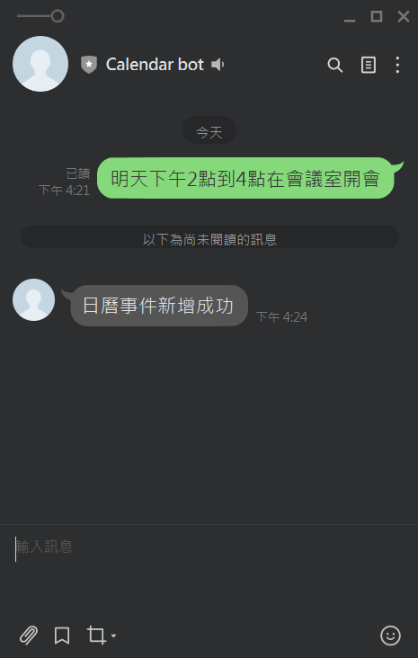

### 動機
有時候在 line 上面跟別人講好日期後，如果沒有將它紀錄下來的話，有時候會忘記，而記錄到日曆又要另外開一個app，非常的麻煩，因此便想說用設計一個Line Bot來處理line上面一些有關日程的留言，並將他自動在Google calendar上設定。

### 使用技術
- Line Messaging API
- Google Calendar API
- Python
- Flask
- ngrok
- LLM(llama.cpp)

### 成果展示
> line對話

> google calendar結果

---
